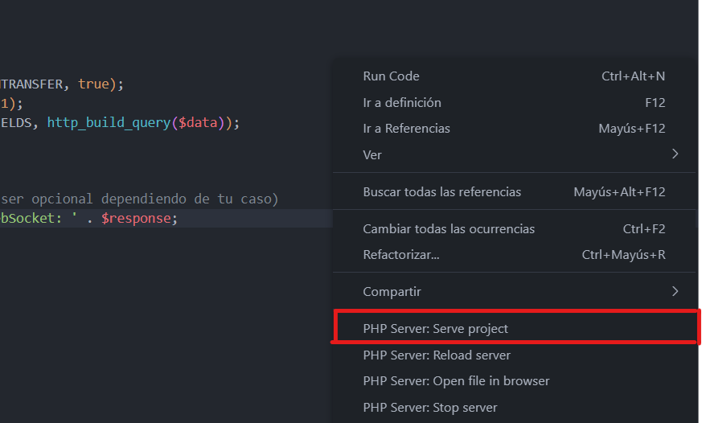

# Chat Node

## Introducciom
El presente trabajo se encarga de mostrar un sistema de chat en tiempo real utilizando tecnologías modernas como Socket.IO, Node.js, JQuery y CSS Bootstrap. Este proyecto tiene como objetivo principal explorar las capacidades de comunicación bidireccional y en tiempo real que ofrecen estas tecnologías, brindando a los usuarios una experiencia de chat dinámica y eficiente. Asimismo, utilizamos PHP para la comunicacion entre el cliente y el websocket.
## Consideraciones
1. Tener instalado Node.js (leer documentación)
```sh
https://nodejs.org/es/
```
2. Tener instalado Socket.io
```sh
npm install socket.io
```
3. Tener instalado Apache Web Server (leer documentación)
```sh
https://www.apachefriends.org 
```
4. Tener instalado las extensiones de PHP en VSCode


6. Tener abierto el puerto 3000 (PHP) y 8080 (JavaScript)
7. Correr primero el archivo JavaScript y cargar la pagina desde http://localhost:8080/
```sh
npm run start
```
8. Luego correr el archivo "enviar-data.php" utilizando PHP Sever (opcional utilizar Apache Web Server con Xaamp) y cargarlo desde http://localhost:3000/


## Archivos Principales

### Index.html
En este archivo se guarda la plantilla y estilos principales de la aplicacion, se utilizo Bootstrap para matener una pagina responsiva y correctamente maquetada.

### Index.js
En este archivo, se lleva a cabo la configuración de la aplicación construida en Express, haciendo uso de la biblioteca Socket.IO de JavaScript. La aplicación se ejecutará mediante Node.js en el puerto 8080.

### Socket.js
Este archivo de socket se encarga de interactuar directamente con el servidor, incorporando métodos para la adición y eliminación de usuarios.

### Main.js
Este archivo se encarga de interactuar directamente con el lado del cliente mediante el uso de jQuery, mejorando la recuperación e interacción con las etiquetas HTML en respuesta a eventos específicos. En adición, utiliza sockets para la eficiente transmisión y recepción de información entre el cliente y el servidor. En relación con los eventos de envío de mensajes, este proceso se optimiza aún más mediante el empleo de webhooks, que facilitan la comunicación instantánea y la gestión eficaz de los eventos asociados al envío de mensajes.

### Enviar-Data.php
Este archivo HTML y PHP está diseñado con el propósito de ilustrar el proceso de envío de datos desde un cliente hacia un servidor WebSocket, específicamente dirigido a una aplicación construida en JavaScript. Vale la pena destacar que el tipo de dato enviado en este ejemplo es de tipo "Time" y sera incorporado en el HTML de la pagina, especificamente en el apartado de registro.

# Registro


# Chat Pantalla 1


# Chat Pantalla 2


# Pagina PHP

